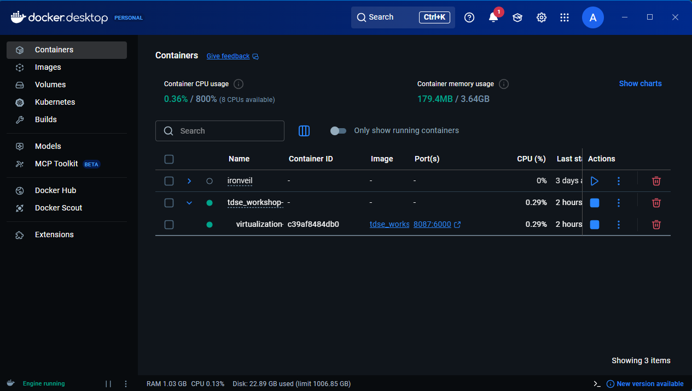
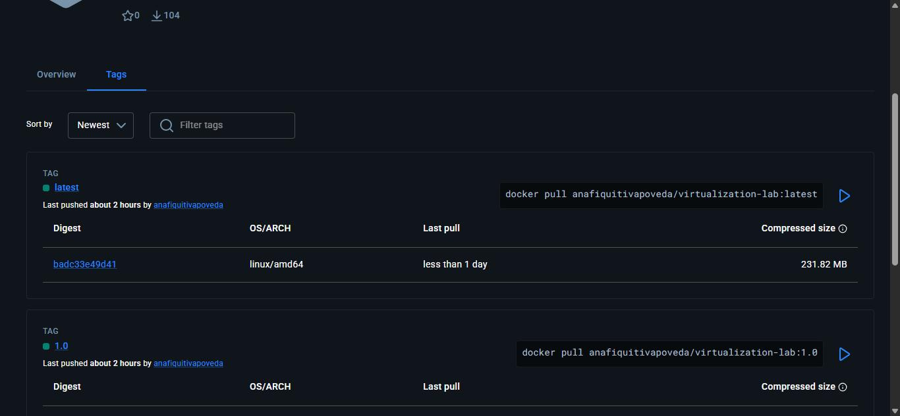
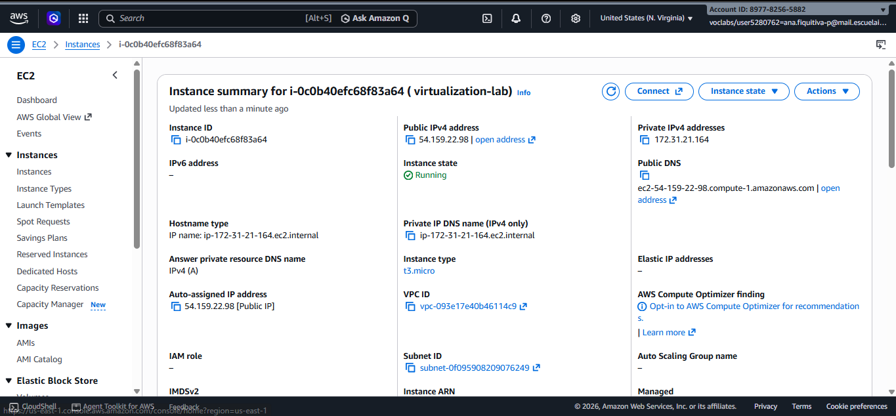
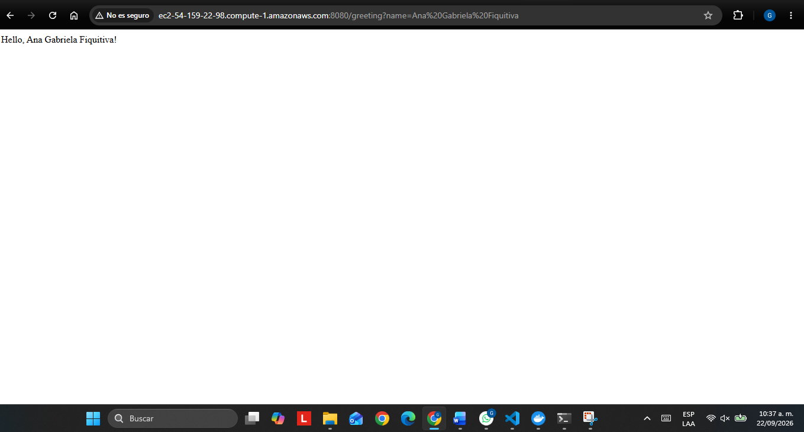
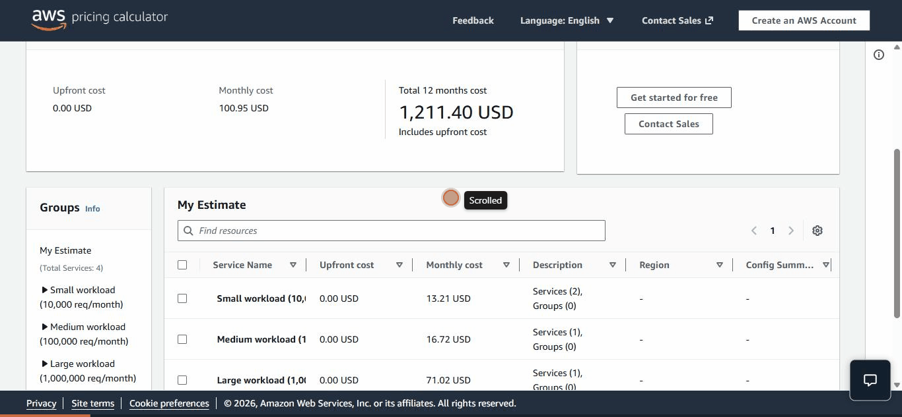
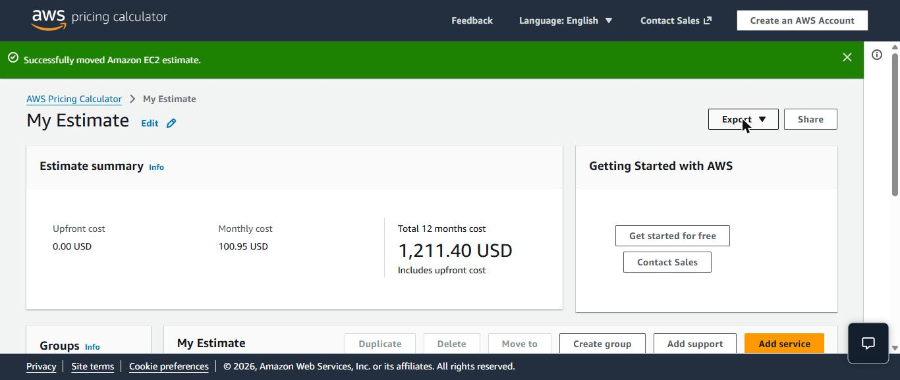
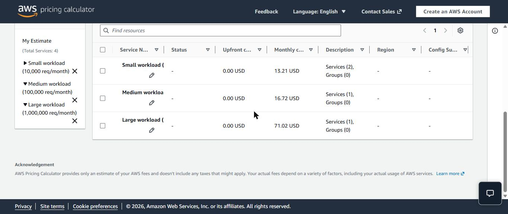

# Laboratorio de Virtualización — Contenerización y Despliegue de una Aplicación Web Java

**Autora:** Ana Gabriela Fiquitiva Poveda
**Contexto académico:** Taller TDSE — Contenerización y despliegue de una aplicación web Java (Spring Boot)

Un servicio REST mínimo en Spring Boot, usado como vehículo para estudiar la virtualización como mecanismo arquitectónico de **modularidad, aislamiento, portabilidad y despliegue**. El mismo artefacto de construcción se ejecuta sin modificaciones como proceso local de la JVM, como contenedor Docker aislado (en una o varias instancias concurrentes), y como servicio en una máquina virtual EC2 de AWS — la configuración cambia únicamente mediante variables de entorno, nunca mediante código o recompilaciones.

## Tabla de contenido

1. [Propósito y objetivos de aprendizaje](#propósito-y-objetivos-de-aprendizaje)
2. [Línea base tecnológica](#línea-base-tecnológica)
3. [Arquitectura y diseño de clases](#arquitectura-y-diseño-de-clases)
4. [Estructura del proyecto](#estructura-del-proyecto)
5. [Parte 1 — Construcción y ejecución local](#parte-1--construcción-y-ejecución-local)
6. [Parte 2 — Contenerización y aislamiento de procesos](#parte-2--contenerización-y-aislamiento-de-procesos)
7. [Parte 3 — Orquestación declarativa con Docker Compose](#parte-3--orquestación-declarativa-con-docker-compose)
8. [Parte 4 — Publicación en Docker Hub](#parte-4--publicación-en-docker-hub)
9. [Parte 5 — Despliegue en AWS EC2](#parte-5--despliegue-en-aws-ec2)
10. [Parte 6 — Modelo de despliegue y análisis de costos](#parte-6--modelo-de-despliegue-y-análisis-de-costos)
11. [Índice de evidencias](#índice-de-evidencias)
12. [Notas sobre la construcción](#notas-sobre-la-construcción)

## Propósito y objetivos de aprendizaje

La virtualización no es una sola tecnología, sino un espectro de mecanismos —desde la emulación completa de hardware hasta el aislamiento de procesos a nivel de sistema operativo— que resuelven el mismo problema de fondo: desacoplar *qué* hace el software de *dónde* y *cómo* se ejecuta. Este taller recorre ese espectro de extremo a extremo usando una sola aplicación deliberadamente pequeña, de modo que cualquier diferencia observada entre entornos de ejecución pueda atribuirse al entorno mismo y no a la complejidad de la aplicación.

En concreto, este repositorio demuestra:

- La construcción de una aplicación web Java cuya configuración de tiempo de ejecución (el puerto de escucha) se externaliza al entorno en lugar de quedar fija en el código — el principio de configuración de [Twelve-Factor App](https://12factor.net/config).
- El empaquetado de esa aplicación como una imagen Docker inmutable, de modo que el artefacto que se prueba sea el artefacto que se despliega.
- La ejecución de varias instancias de esa imagen de forma aislada en un mismo host, para observar el aislamiento de contenedores directamente en lugar de asumirlo.
- La publicación de la imagen en un registro público (Docker Hub), desacoplando *dónde se construye una imagen* de *dónde se ejecuta*.
- El despliegue de esa misma imagen en una máquina virtual EC2 de AWS y la verificación de que es alcanzable desde internet público.
- El razonamiento cuantitativo sobre cuánto cuesta ese despliegue a distintos volúmenes de tráfico, y en qué punto el modelo deja de tener sentido económico.

## Línea base tecnológica

| Componente | Versión | Rol |
|---|---|---|
| Java | 21 LTS (Amazon Corretto) | Runtime del lenguaje |
| Maven | 3.9.16 | Herramienta de construcción |
| Spring Boot | 4.1.1 | Framework de la aplicación |
| Docker Desktop | con Compose v2 | Contenerización y orquestación local |
| Docker Hub | `anafiquitivapoveda/virtualization-lab` | Registro de imágenes |
| Amazon Linux 2023 | en EC2 | Sistema operativo de despliegue |

## Arquitectura y diseño de clases

```
co.edu.escuelaing
├── RestServiceApplication   — punto de entrada; lee la variable PORT, default 6000
└── HelloRestController      — @RestController, GET /greeting?name=...
```

La aplicación es intencionalmente mínima —dos clases— para que la variable de estudio del taller sea el *entorno de despliegue*, no la *lógica de la aplicación*.

- **`RestServiceApplication`** fija `server.port` a partir de la variable de entorno `PORT` mediante `SpringApplication.setDefaultProperties`, usando `6000` por defecto cuando `PORT` no está definida. Esta única línea es lo que permite que el mismo artefacto compilado escuche en el puerto 6000 al ejecutarse directamente en la máquina de un desarrollador, en un puerto interno arbitrario dentro de un contenedor, y en el puerto externo que decida expone el security group de EC2 — sin cambios de código ni recompilaciones entre entornos. Esta es la demostración práctica central de la *portabilidad*: el artefacto es agnóstico al entorno por construcción.
- **`HelloRestController`** expone un único endpoint, `GET /greeting?name=<name>`, que retorna `Hello, <name>!` (por defecto `World`). Mantener la lógica de negocio trivial aísla la variable bajo estudio al mecanismo de despliegue.

## Estructura del proyecto

```
pom.xml
Dockerfile
compose.yaml
.dockerignore
src/main/java/co/edu/escuelaing/RestServiceApplication.java
src/main/java/co/edu/escuelaing/HelloRestController.java
src/test/java/co/edu/escuelaing/HelloRestControllerTest.java
evidence/                  — salida de comandos, capturas y una grabación usadas como evidencia en este documento
```

## Parte 1 — Construcción y ejecución local

```bash
mvn clean package
java -jar target/virtualization-lab-1.0.0.jar
```

Verificación:

```
http://localhost:6000/greeting?name=Pedro
→ Hello, Pedro!
```

**Evidencia** — [`evidence/local_run_greeting.txt`](evidence/local_run_greeting.txt):

```
$ mvn clean package
[INFO] BUILD SUCCESS

$ java -jar target/virtualization-lab-1.0.0.jar
Tomcat started on port 6000 (http) with context path '/'
Started RestServiceApplication in 3.499 seconds

$ curl "http://localhost:6000/greeting?name=Pedro"
Hello, Pedro!
```

## Parte 2 — Contenerización y aislamiento de procesos

`Dockerfile` (single-stage, siguiendo literalmente la especificación del taller — el JAR se compila con Maven *antes* de construir la imagen, y luego se copia como artefacto estático):

```dockerfile
FROM amazoncorretto:21

WORKDIR /app

COPY target/*.jar app.jar

ENV PORT=6000

EXPOSE 6000

ENTRYPOINT ["java", "-jar", "app.jar"]
```

`amazoncorretto:21` se elige como imagen base específicamente porque solo trae la capa JRE/JDK necesaria para ejecutar el JAR — la imagen no contiene herramientas de construcción, acercando el artefacto final a lo que realmente se ejecutará en producción.

Construcción e inspección:

```bash
mvn clean package
docker build -t anafiquitivapoveda/virtualization-lab:1.0 .
docker images
```

**Evidencia** — [`evidence/docker_images.txt`](evidence/docker_images.txt):

```
REPOSITORY                              TAG       IMAGE ID       CREATED          SIZE
anafiquitivapoveda/virtualization-lab   1.0       956f1dfa72ec   56 seconds ago   771MB
anafiquitivapoveda/virtualization-lab   latest    956f1dfa72ec   56 seconds ago   771MB
```

Ejecución de un contenedor, mapeando su puerto interno a un puerto del host:

```bash
docker run -d \
  --name virtualization-lab-1 \
  -e PORT=6000 \
  -p 34000:6000 \
  anafiquitivapoveda/virtualization-lab:1.0
```

```
http://localhost:34000/greeting?name=Container
→ Hello, Container!
```

### Demostración del aislamiento entre contenedores

Se lanzan dos instancias adicionales de la *misma* imagen, cada una en su propio puerto del host:

```bash
docker run -d --name virtualization-lab-2 -p 34001:6000 anafiquitivapoveda/virtualization-lab:1.0
docker run -d --name virtualization-lab-3 -p 34002:6000 anafiquitivapoveda/virtualization-lab:1.0
```

**Evidencia** — [`evidence/docker_ps.txt`](evidence/docker_ps.txt), [`evidence/greeting_isolation_tests.txt`](evidence/greeting_isolation_tests.txt):

```
CONTAINER ID   IMAGE                                        COMMAND               STATUS          PORTS
53ce04698720   anafiquitivapoveda/virtualization-lab:1.0   "java -jar app.jar"   Up 7 seconds    0.0.0.0:34002->6000/tcp
eece73027dcb   anafiquitivapoveda/virtualization-lab:1.0   "java -jar app.jar"   Up 8 seconds    0.0.0.0:34001->6000/tcp
c5da97b958ee   anafiquitivapoveda/virtualization-lab:1.0   "java -jar app.jar"   Up 9 seconds    0.0.0.0:34000->6000/tcp

$ curl "http://localhost:34000/greeting?name=Container"
Hello, Container!
$ curl "http://localhost:34001/greeting?name=Container2"
Hello, Container2!
$ curl "http://localhost:34002/greeting?name=Container3"
Hello, Container3!
```

Confirmación visual en Docker Desktop, con los contenedores corriendo simultáneamente:



Tres contenedores, una sola imagen compartida, tres instancias de ejecución completamente independientes — cada una con su propio namespace de PID, su propio overlay de sistema de archivos y su propia pila de red, sin requerir espacio en disco adicional para el código de la aplicación más allá de las capas de la imagen, compartidas y de solo lectura. Este es el beneficio práctico de la virtualización a nivel de sistema operativo: aislamiento sin el sobrecosto de duplicar un sistema operativo invitado completo por instancia, como sí lo exigiría una VM basada en hipervisor.

## Parte 3 — Orquestación declarativa con Docker Compose

`compose.yaml`:

```yaml
services:
  web:
    build: .
    container_name: virtualization-web
    environment:
      PORT: 6000
    ports:
      - "8087:6000"
```

```bash
docker compose up -d --build
docker compose ps
docker compose logs web
```

**Evidencia** — [`evidence/docker_compose_ps.txt`](evidence/docker_compose_ps.txt), [`evidence/docker_compose_logs.txt`](evidence/docker_compose_logs.txt):

```
NAME                 SERVICE   STATUS          PORTS
virtualization-web   web       Up 13 seconds   0.0.0.0:8087->6000/tcp

...
:: Spring Boot ::                (v4.1.1)
Tomcat started on port 6000 (http) with context path '/'
Started RestServiceApplication in 4.981 seconds

$ curl "http://localhost:8087/greeting?name=Compose"
Hello, Compose!
```

No se agregó un servicio de base de datos al archivo de Compose. La aplicación es *stateless* por diseño —cada solicitud se atiende y responde sin tocar disco ni ningún almacenamiento externo—, así que introducir una capa de persistencia (por ejemplo MongoDB, tal como el taller advierte explícitamente evitar hacer sin necesidad) agregaría infraestructura sin ningún requisito que la justifique.

## Parte 4 — Publicación en Docker Hub

```bash
docker login
docker tag anafiquitivapoveda/virtualization-lab:1.0 anafiquitivapoveda/virtualization-lab:latest
docker push anafiquitivapoveda/virtualization-lab:1.0
docker push anafiquitivapoveda/virtualization-lab:latest
```

**Repositorio en Docker Hub:** https://hub.docker.com/r/anafiquitivapoveda/virtualization-lab

**Evidencia** — [`evidence/docker_push_1.0.txt`](evidence/docker_push_1.0.txt), [`evidence/docker_push_latest.txt`](evidence/docker_push_latest.txt):

```
1.0: digest: sha256:956f1dfa72ec29280985910794f0f9a003aa62eaf0a767c7280eb06cc1c24cd2 size: 856
latest: digest: sha256:956f1dfa72ec29280985910794f0f9a003aa62eaf0a767c7280eb06cc1c24cd2 size: 856
```

Ambos tags apuntan a la misma imagen subyacente y son visibles públicamente en el repositorio de Docker Hub, confirmado a continuación:



Publicar en un registro es lo que hace que la imagen sea *portable entre hosts sin un sistema de archivos compartido* — la instancia EC2 de la Parte 5 nunca ve el código fuente ni la cadena de construcción local; solo descarga (`pull`) el artefacto final y versionado.

## Parte 5 — Despliegue en AWS EC2

Se lanzó una instancia `t3.micro` con Amazon Linux 2023.

**Evidencia** — Consola de EC2, instancia `i-0c0b40efc68f83a64` en estado `Running`, tipo `t3.micro`, región `US East (N. Virginia)`:



**Nota sobre el security group:** por restricciones de la red institucional (universidad) que bloqueaban intermitentemente el acceso, las reglas de entrada de SSH (puerto 22) y del puerto de la aplicación (8080) se dejaron temporalmente abiertas a cualquier IP (`0.0.0.0/0`) en lugar de restringirlas a una IP específica, que es lo que recomienda el taller y la buena práctica de seguridad. Esta es una desviación consciente y documentada del principio de mínima exposición, hecha únicamente para completar la verificación del despliegue durante la ventana de evaluación — **la instancia debe terminarse (o el security group debe volver a restringirse) inmediatamente después de la revisión** para no dejar un servidor SSH expuesto a internet.

**Nota de conectividad (un obstáculo real, documentado por completitud):** el cliente OpenSSH desde una terminal local agotó el tiempo de espera al conectar por el puerto 22, incluso cuando el security group todavía estaba restringido a la IP pública de la máquina. El diagnóstico (`Test-NetConnection`, verificación de resolución DNS) aisló la causa al bloqueo del puerto 22 saliente por parte de la red institucional —una restricción común en redes universitarias/corporativas—, no a una mala configuración del lado de AWS. Se usó en su lugar **AWS EC2 Instance Connect** (el cliente SSH basado en navegador, integrado en la consola de EC2), ya que su ruta de tráfico no depende de la política de puerto 22 saliente de la red local.

Instalación de Docker y ejecución de la imagen, corridas en la instancia vía EC2 Instance Connect:

```bash
sudo yum update -y
sudo yum install -y docker
sudo service docker start
sudo usermod -a -G docker ec2-user
# reconectar para que el nuevo grupo tenga efecto
docker pull anafiquitivapoveda/virtualization-lab:1.0
docker run -d \
  --name virtualization-lab \
  --restart unless-stopped \
  -e PORT=6000 \
  -p 8080:6000 \
  anafiquitivapoveda/virtualization-lab:1.0
```

**Evidencia** — [`evidence/ec2_deployment.txt`](evidence/ec2_deployment.txt):

```
$ docker ps
CONTAINER ID   IMAGE                                       COMMAND               STATUS          PORTS
7a7a660a9395   anafiquitivapoveda/virtualization-lab:1.0   "java -jar app.jar"   Up 46 seconds   0.0.0.0:8080->6000/tcp

$ docker logs virtualization-lab
:: Spring Boot ::                (v4.1.1)
Tomcat started on port 6000 (http) with context path '/'
Started RestServiceApplication in 3.402 seconds

$ curl "http://ec2-54-159-22-98.compute-1.amazonaws.com:8080/greeting?name=AWS"
Hello, AWS!
```

**URL pública de despliegue:** http://ec2-54-159-22-98.compute-1.amazonaws.com:8080/greeting?name=AWS

Confirmación desde el navegador, desde una máquina cliente distinta:



> **Nota de gestión de costos:** esta URL solo permanece alcanzable mientras la instancia EC2 esté en ejecución. Termina la instancia desde la consola de EC2 después de la revisión/calificación para evitar cargos continuos — una máquina virtual se cobra por hora sin importar si alguien le está enviando solicitudes o no, que es exactamente el fenómeno que se cuantifica en la Parte 6.

## Parte 6 — Modelo de despliegue y análisis de costos

El despliegue no es una decisión puramente técnica — cada elección arquitectónica aquí conlleva un costo recurrente correspondiente y cuantificable. Esta sección hace explícito ese costo y razona sobre dónde el modelo se sostiene y dónde se rompe.

### Modelo de despliegue

```
Cliente
  ↓ Solicitud HTTP
Máquina virtual EC2
  ↓
Docker Engine
  ↓
Contenedor de la aplicación web Java
```

| Capa | Responsabilidad |
|---|---|
| Máquina virtual EC2 | Recursos aislados de cómputo, memoria, almacenamiento y red, alquilados por hora sin importar la utilización. |
| Docker Engine | Ejecuta el proceso aislado del contenedor; media su acceso al kernel del host, al namespace de red y al sistema de archivos. |
| Contenedor Docker | Un entorno de ejecución portátil que empaqueta la aplicación junto con su runtime de la JVM, independiente del software que tenga instalado el host. |
| Aplicación web Java | Recibe solicitudes HTTP y provee la funcionalidad de negocio (`/greeting`). |
| Security group | La única puerta de red en este modelo — determina qué tráfico entrante puede siquiera llegar a la máquina virtual antes de que cualquiera de las capas anteriores lo vea. |

### Supuestos de carga de trabajo

| Escenario | Solicitudes/mes | Región | Tipo de instancia | Instancias | Tiempo mensual | EBS | Transferencia saliente | Tamaño prom. solicitud/respuesta | ¿Continuo? | ¿Requiere alta disponibilidad? |
|---|---|---|---|---|---|---|---|---|---|---|
| Pequeño | 10.000 | us-east-1 | t3.micro | 1 | 720 h | 8 GB gp3 | ~1 GB | ~0.5 KB / ~0.3 KB | Sí (siempre encendido, tráfico bajo) | No |
| Mediano | 100.000 | us-east-1 | t3.small | 1 | 720 h | 8 GB gp3 | ~10 GB | ~0.5 KB / ~0.3 KB | Sí | No |
| Grande | 1.000.000 | us-east-1 | t3.medium | 2 (detrás de un balanceador de carga) | 720 h cada una | 8 GB gp3 cada una | ~100 GB | ~0.5 KB / ~0.3 KB | Sí | Sí |

El tamaño de instancia sigue el volumen de solicitudes en lugar de ser fijo: una `t3.micro` atiende sin dificultad 10.000 solicitudes/mes a la tasa implícita de tráfico (muy por debajo de 1 solicitud cada pocos minutos en promedio), mientras que el volumen sostenido del escenario grande (aproximadamente 23 solicitudes/minuto de forma continua) justifica tanto una clase de instancia más grande como una segunda instancia para holgura y disponibilidad.

### Estimación de costos

Generada con la [Calculadora de Precios de AWS](https://calculator.aws/) (región `us-east-1`, precios On-Demand, un grupo de estimación por escenario), cubriendo cómputo EC2, almacenamiento EBS (gp3) y transferencia de datos saliente — las tres dimensiones de costo que especifica el taller.

**Link público de la estimación:** https://calculator.aws/#/estimate?id=9822927fb6b20dedfb570895585cc51afbc38fc7
*(los links públicos de AWS expiran después de un año; las capturas y el GIF a continuación son la copia duradera de esta evidencia.)*

**Recorrido (GIF):** un recorrido grabado sobre la estimación en vivo, desde el resumen total hacia cada uno de los tres grupos de escenario y de vuelta.






| Escenario | Solicitudes mensuales | Costo mensual de infraestructura | Costo estimado por solicitud | Principales factores de costo |
|---|---|---|---|---|
| Carga pequeña | 10.000 | USD 13.21 | USD 0,001321 | Tiempo de ejecución EC2 (t3.micro, 720 h) y 8 GB de almacenamiento EBS |
| Carga media | 100.000 | USD 16.72 | USD 0,0001672 | Tiempo de ejecución EC2 (t3.small, 720 h), almacenamiento y 10 GB de transferencia de red |
| Carga grande | 1.000.000 | USD 71.02 | USD 0,00007102 | Dos instancias t3.medium, almacenamiento y 100 GB de transferencia de red |

`Costo estimado por solicitud = costo mensual de infraestructura / solicitudes mensuales`

El costo por solicitud cae aproximadamente **19×** del escenario pequeño al grande, aunque el costo total de infraestructura solo crece ~5.4× ante un aumento de 100× en el tráfico. El mecanismo es la amortización: el costo horario fijo de EC2 es casi constante y se divide entre un número cada vez mayor de solicitudes a medida que crece el volumen, así que su porción por solicitud se reduce — hasta que el volumen obliga a una instancia más grande o adicional, lo cual reinicia ese costo fijo en una nueva base, más alta.

### Discusión arquitectónica

**¿Por qué un despliegue basado en EC2 tiene un costo mensual base incluso con pocas solicitudes?**
Porque la facturación está atada a que la instancia esté *encendida*, no al trabajo realmente realizado. El cómputo, el almacenamiento EBS y la capacidad de red reservada se acumulan por hora sin importar el tráfico — una `t3.micro` corriendo 720 horas al mes cuesta lo mismo si responde 10 solicitudes o 10.000. No existe en este modelo un mecanismo para que la factura se reduzca cuando el tráfico es bajo.

**¿A partir de qué nivel de carga de trabajo el costo fijo se vuelve menos significativo por solicitud?**
A medida que el volumen de solicitudes crece mientras el tamaño de la instancia se mantiene fijo, el costo horario constante se divide entre más solicitudes, así que la porción por solicitud cae de forma marcada — esto es más visible aquí al pasar del escenario pequeño al mediano (13.21 → 16.72 por un salto de 10× en solicitudes). Esa caída se aplana, e incluso puede revertirse localmente, cada vez que el tráfico obliga a subir a una instancia más grande o adicional, ya que eso reinicia el costo fijo en una nueva base antes de que la amortización vuelva a alcanzarlo.

**¿Qué obligaría a pasar de una instancia EC2 a varias instancias?**
Saturación sostenida de CPU o memoria en el tamaño de instancia actual; la necesidad de despliegues sin downtime y actualizaciones rodantes (imposible con exactamente una instancia sirviendo tráfico); requisitos de latencia geográfica que un despliegue de una sola región y una sola instancia no puede cumplir; o un requisito de alta disponibilidad, ya que una instancia EC2 es por definición un punto único de falla — su hardware anfitrión, su zona de disponibilidad y la instancia misma pueden fallar de forma independiente y tumbar todo el servicio.

**¿Qué servicios adicionales requeriría probablemente un despliegue en producción?**
Un balanceador de carga (ALB) para alta disponibilidad y despliegues rodantes sin downtime; una base de datos administrada (RDS) en el momento en que la aplicación necesite persistir algo; CloudWatch para monitoreo, logging y alertas (este despliegue actualmente no tiene ninguno — una falla pasaría inadvertida); copias de seguridad automatizadas de snapshots de EBS; y un registro de contenedores, ya sea un repositorio privado en ECR o continuar usando Docker Hub, para una distribución controlada de imágenes en lugar de un `docker pull` manual en cada host.

**¿Sería más rentable una implementación sin servidor para el escenario de carga pequeña?**
Muy probablemente sí — argumentado desde las características propias de la carga de trabajo y no desde una preferencia general por lo serverless. A 10.000 solicitudes/mes, la tasa implícita de solicitudes es aproximadamente una solicitud cada cuatro minutos en promedio: la instancia EC2 de este escenario está inactiva, por construcción, más del 99.9% del tiempo, y sin embargo se cobra por las 720 horas completas sin importar eso. Una opción serverless (por ejemplo AWS Lambda detrás de API Gateway) cobra por invocación y por milisegundo de ejecución, sin costo mientras está inactiva, lo cual se ajusta directamente al patrón real de utilización de esta carga de trabajo en lugar de pagar por capacidad provisionada pero no usada. El balance se invierte a medida que crecen el volumen de solicitudes y la latencia por solicitud: superado cierto umbral de throughput, el costo acumulado por invocación serverless supera el costo amortizado de una instancia EC2 de costo fijo — que es exactamente el cruce visible en los escenarios mediano y grande anteriores, donde la instancia EC2 está mucho más consistentemente utilizada.

### Conclusión

EC2 es apropiado para los escenarios mediano y grande evaluados aquí: $16.72–$71.02/mes es un costo pequeño y predecible para 100.000–1.000.000 de solicitudes, y el costo por solicitud sigue cayendo a medida que crece el tráfico, lo que indica que la instancia hace proporcionalmente más trabajo útil por cada dólar invertido. Para el escenario de carga pequeña, $13.21/mes por solo 10.000 solicitudes refleja una instancia inactiva la abrumadora mayoría del tiempo — es el propio perfil de tráfico bajo y esporádico de esa carga de trabajo el argumento a favor de una alternativa serverless aquí, no una preferencia tecnológica general. EC2 se vuelve la opción económicamente eficiente específicamente cuando el tráfico es lo bastante constante y voluminoso para mantener la instancia ocupada de forma significativa; por debajo de ese umbral, su modelo de facturación siempre-encendido está pagando por capacidad inactiva.

## Índice de evidencias

Toda la salida de comandos, capturas y grabaciones referenciadas arriba viven en [`evidence/`](evidence/):

| Archivo | Parte | Contenido |
|---|---|---|
| `local_run_greeting.txt` | 1 | Ejecución local de `mvn clean package` + `java -jar` y verificación del endpoint. |
| `docker_images.txt` | 2 | Imagen construida, ambos tags. |
| `docker_ps.txt`, `greeting_isolation_tests.txt` | 2 | Tres contenedores aislados corriendo simultáneamente, cada uno respondiendo de forma independiente. |
| `docker_desktop_containers.png` | 2 | Captura de Docker Desktop mostrando los tres contenedores en ejecución. |
| `docker_compose_ps.txt`, `docker_compose_logs.txt` | 3 | Servicio administrado por Compose, logs de arranque, verificación del endpoint. |
| `docker_push_1.0.txt`, `docker_push_latest.txt` | 4 | Digests de publicación en Docker Hub para ambos tags. |
| `dockerhub_tags.jpg` | 4 | Página pública del repositorio en Docker Hub, confirmando que ambos tags están publicados. |
| `ec2_instance_running_console.png` | 5 | Consola de AWS EC2 mostrando la instancia en estado `Running`. |
| `ec2_deployment.txt` | 5 | `docker ps` / `docker logs` en EC2 y un `curl` del lado del servidor contra el endpoint público. |
| `ec2_browser_screenshot.png` | 5 | Confirmación desde el navegador del endpoint público en vivo, desde un cliente distinto. |
| `aws_pricing_calculator_summary.jpg`, `aws_pricing_calculator_groups.jpg` | 6 | Estimación de la Calculadora de Precios de AWS, totales y desagregado por escenario. |
| `part6_cost_analysis_walkthrough.gif` | 6 | Recorrido grabado de la estimación de costos en vivo por los tres escenarios. |

## Notas sobre la construcción

El `Dockerfile` de referencia del taller es single-stage y espera que `target/*.jar` ya exista — es decir, se espera que `mvn clean package` se ejecute previamente con una instalación local de JDK 21 y Maven. Este repositorio sigue eso literalmente: Amazon Corretto 21 y Maven se instalaron en la máquina de construcción específicamente para poder compilar el JAR antes de correr `docker build`, en lugar de mover la construcción de Maven a un Dockerfile multi-stage (una alternativa válida, pero no lo que especifica el `Dockerfile` provisto por el taller).
